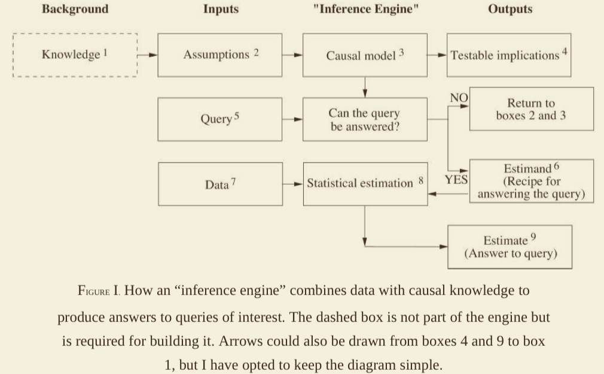

+++
title = "The Book of Why"
slug = "01072021082043-book-of-why"
tags = ["bibliography", "causality", "diagrams", "counterfactual", "statistics", "graphs", "book", "blog", "archive"]
description = "How causality gives us tools to understand the question of cause-and-effect and confounders"
rss_title = "The Book of Why"
rss_description = "How causality gives us tools to understand the question of cause-and-effect and confounders"
rss_pubdate = Date(2021, 1, 7)
+++

The Book of Why
=========

**Date:** January 7 2021

**Summary:** How causality gives us tools to understand the question of cause-and-effect and confounders

**Keywords:** ##bibliography #causality #diagrams #counterfactual #statistics #graphs ##book ##blog #archive

Bibliography
==========

J. Pearl and D. Mackenzie, The book of why: the new science of cause and effect, First edition. New York: Basic Books, 2018.

Table of Contents
=========

\toc

This book shows that data is stupid. Data can record events but cannot answer why any of the events are the way they are.

Causal inference posits the brain as the most advanced tool for understanding cause and effect.

Forcing an occurrence means to submit it to one influence to trigger the desired event

**Counterfactual:** When scientific inquiry involves retrospective reflection. "Why?" is a counterfactual question.

Probabilities encode our beliefs about a static world. Causality explains probabilities in a changing world.

### Benefits of Causal Analysis

Create a smoother human-machine interface.

*THOUGHTS: I wonder if that is what attracted me to the idea of Causal Inference - that it enables better human-machine interfaces. Like human-machine interaction as a discipline; I wonder if they have much in this area. Perhaps reach out to Valentine Wilson about the question?*

### Critiques of Statistics

Galton separated causation from statistics in 1889 causing the two separate fields to fully manifest.

"Granger causality" and "vector autocorrelation" exists to accommodate for causal explanations. Associated Thoughts: Judea's critique on probability-based causality

### Causal Calculus

Causal calculus uses two communications forms: 

1. Causal Diagrams: communicates what is known.
2. Symbolic language: defines what is wanted to be known

### Inference Engine

The inference engine assumes perfect and unlimited data for the given figure:

**Estimand:** generalized mathematical formula to answer data questions. A statistical quantity estimated from data that can represent an answer to a query.

A given estimand is computed on the basis of the causal model alone, prior to an examination of the specifics of the data. This gives the inference engine better adaptibility.

**Binary Evaluation of Query:** determines if a query can be answered under an existing causal model.

**Knowledge:** experience from the past such as prior observations and education.

**Assumptions:** explicit statements from available Knowledge.

**Queries:** the scientific questions to be answered.

**Testable Implications:** observable patterns or dependencies resulting from the listening pattern of a causal model.

**Estimate:** Estimate for the answer is determined alongside uncertainty metrics.The metrics reflect limited data, measurement errors, or missing data.

### Ladder of Causality

First rung: observation. This concerns recognition of patterns. This rung asks, "What if I see ...?"

The second rung: Doing. Altering an environment to achieve a certain goal. This rung poses the questions of "What if we do...?" or "How?"

### Mini-Turing Test

Mini-Turing Test: Encode a simple story on a machine and see if it can answer causal questions a human can answer.

Rules:

1. Limited only to causal reasoning and language.
2. The story can be encoded in the easiest way for the programmer.

### Bayesian Analysis

Simplified Bayesian analysis: prior belief + new evidence = revised belief.

Bayesian inference enables one to express personal experiences mathematically and combine it with data in a principled and transparent way.

### Causal Diagrams

"Causation" via a causal diagram is straightforward. A variable X is a cause of Y if Y listens to X. Y's value is determined by what it hears.

#### Paths in Path Diagrams

##### Chain junction

$$
A \rightarrow B \rightarrow C
$$

B is the mediator which relays the effect of A to C. B filters information about A from C.

##### Fork Junction

$$
A \leftarrow B \rightarrow C
$$

B is a confounder of A and C. B makes A and C statistically correlated despite no direct link between them.

##### Collider Junction

$$
A \rightarrow B \leftarrow C
$$

Conditioning on B will make A and C dependent

#### Lessons from Path Diagrams

1. Causal analysis allows us to quantify real world processes
2. Path analysis draws conclusions about individual causal relationships by examining the diagram as a whole.
3. Two people creating differing causal diagrams for the same data and may not arrive at the same result.

## References

## References
## Discussion: 

{{ addcomments }}
