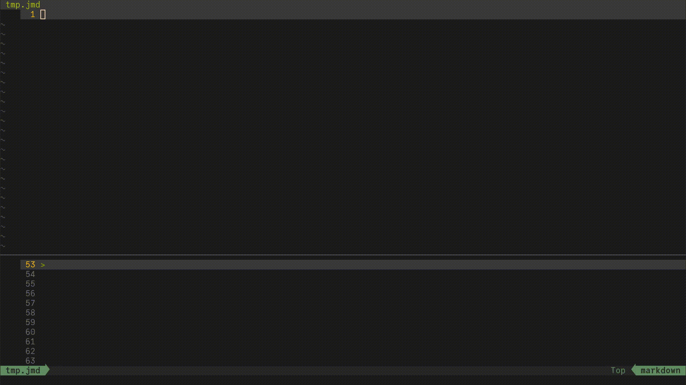
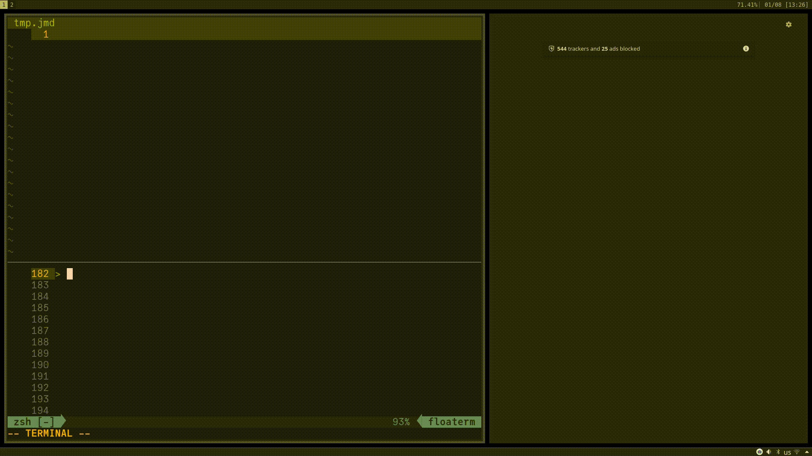

+++
title = "Asynchronous Workflow Using Julia Tutorial"
slug = "01082023043553-julia-async-workflow"
tags = ["blog", "archive", "julia", "programming", "literate", "workflow", "asynchronous", "weave", "browser", "sync", "node"]
description = "A thorough tutorial on how to use Julia for asynchronous workflows to do many things, at once!"
rss_title = "Asynchronous Workflow Using Julia Tutorial"
rss_description = "A thorough tutorial on how to use Julia for asynchronous workflows to do many things, at once!"
rss_pubdate = Date(2023, 1, 7)
+++


Asynchronous Workflow Using Julia Tutorial
=========

**Date:** January 7 2023

**Summary:** A thorough tutorial on how to use Julia for asynchronous workflows to do many things, at once!

**Keywords:** #blog #archive #julia #programming #literate #workflow #asynchronous #weave #browser #sync #node

Bibliography
==========

Not Available

Table of Contents
=========

\toc

### Motivation

I sometimes find myself wanting to execute a Julia file I have just edited.  This is different than what the excellent [Revise.jl package (created by Tim Holy)](/https://github.com/timholy/Revise.jl) does in that I want to execute the full file and not just update function definitions. Moreover, I may just want Julia to do something else entirely upon updating a file or directory. This can be very helpful in analysis workflows as well as literate programming. Creating an extended post on my process for this was inspired by a [Julia Discourse post I provided an answer to](/https://discourse.julialang.org/t/franklin-jl-automatically-evaluate-jl-file-on-change/92580/6).

### Set-Up

Here is how I recommend setting up your Julia environment to follow this tutorial (I assume you have Julia installed correctly):

1. Create an empty directory (folder) somewhere on your computer. (NOTE: For sake of this tutorial, I will refer to it as the "test" folder).
2. Within your favorite text editor (like Notepad, Vim, VSCode, etc.), open this directory.
3. Open and create a file called "tmp.jmd" (NOTE: Keep the file and your editor open as we will be coming back to this file quite a lot).
4. Open your Julia REPL within the directory and activate a temporary environment within package mode:

```julia-repl
pkg> activate --temp
```

5. Add into this temporary environment the following packages:

```julia-repl
pkg> add FileWatching, Weave
```

6. Install node onto your machine.

I suggest using the great tool, [`nvm`, which allows easy management of node versions](/https://github.com/nvm-sh/nvm).

7. Install the node package, [`browser-sync`, which allows for syncing of webpages based on updates](/https://www.npmjs.com/package/browser-sync).

Here is the command you can use in your command line: 

```sh
npm i -g browser-sync 
```

> NOTE: Steps 6 and 7 are not necessary if you are not interested in the [section on literate programming](/#asynchronous-workflow-for-literate-programming)


### Simple Workflow Process

There are two ways to start this workflow.  One blocking (i.e. you cannot use the Julia REPL while working) and another spawning an asynchronous background process to enable you to work with the same REPL. Here is gif showing these workflows in action:



#### Blocking Workflow

This creates a synchronous task in your Julia REPL that can then run whatever command you want while you monitor a specific file (or folder). In this case, I am making the task print a statement that says “Change Detected!” to my REPL whenever there is a change in the file called “tmp.jmd”.

```julia
using FileWatching

while true 
    watch_file("./tmp.jmd")
    println("Change Detected!")
end
```

This workflow is not optimal as this loop continues and locks your REPL from doing anything else. 

#### Asynchronous Workflow

This creates an asynchronous task in the background of your Julia REPL that can then run whatever command you want while you monitor a specific file (or folder). In this case, I am making the task print a statement that says “Change Detected!” to my REPL whenever there is a change in the file called “tmp.jmd”.

```julia
using FileWatching

@async while true 
    watch_file("./tmp.jmd")
    println("Change Detected!")
end
```

From here, you could then still interact with this REPL while this task is running in the background. Furthermore, you can change the line that says `println("Change Detected!")` to whatever command (or commands) you want to trigger.

### Asynchronous Workflow for Literate Programming

This workflow allows one to work with a Julia Markdown document with `Weave.jl` to preview your work in real time.  There a few steps to start the workflow but here is how it looks when in operation:



First, execute the following snippet in your Julia REPL to start the asynchronous process to watch for changes and tell Julia to weave the file we will modify:

```julia
using FileWatching
using Weave

@async while true 
    watch_file("./tmp.jmd")
    weave("./tmp.jmd")
end
```

Next, run this in a separate terminal:

```sh
browser-sync start --server --start --file "./*.html"
```

or this command within your Julia REPL (NOTE: This will make your REPL session very cluttered but you can still use your REPL):

```julia
@async run(`browser-sync start --server --start --file "./*.html"`)
```

At this point, you should see `browser-sync` spit out a lot of information that looks something like this:

```sh
[Browsersync] Access URLs:
 --------------------------------------
       Local: http://localhost:3000
    External: http://192.168.1.186:3000
 --------------------------------------
          UI: http://localhost:3001
 UI External: http://localhost:3001
 --------------------------------------
[Browsersync] Serving files from: ./
```

You'll want to grab that URL that looks like `http://localhost:3000` in the `Local` spot and then open that in your web browser.  With the URL that you get (it could be on a different port), navigate to `http://localhost:3000/tmp.html`.

Finally, when you have this all in place, go ahead and add this code block into the `tmp.jmd` file that was created:

````markdown
# Hello World 

This is a Julia Markdown file. 

```julia 
2 + 2
```
````

You should see a few things happen.  You'll see a few messages from the Julia REPL stating that `Weave.jl` is weaving your document to your desired output. Then, you'll see `browser-sync` say something about updating or syncing.  Finally, you will see your browser update to the latest version of your weaved document. 

Feel free to play around with this more and see the dynamism of the workflow! I tend to do this when I am iteratively developing reports within Julia and want to tinker within the REPL at the same time I am creating documents. Having to wait for rendering `Weave.jl` documents and the like was a pain and this took the pain away.

### Conclusion

I hope you appreciated this post! If you have any suggestions, comments, or additional workflows this could be used for, please comment below.  May your Julia sessions now be even more supercharged!

## References

## References:
## Discussion: 

{{ addcomments }}
