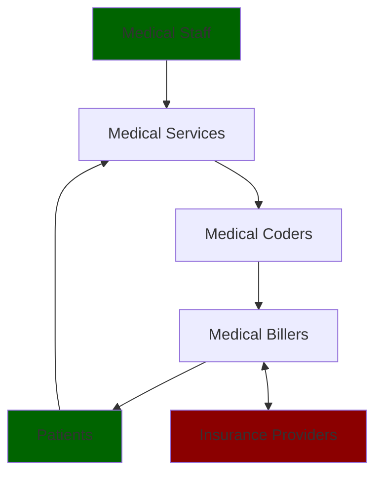

+++
title = "What Are Claims?"
slug = "02142022220749-claims-summary"
tags = ["archive", "us", "claims", "medical", "process", "patient"]
description = "An overview on what are medical claims within the US"
rss_title = "What Are Claims?"
rss_description = "An overview on what are medical claims within the US"
rss_pubdate = Date(2022, 2, 14)
+++

What Are Claims?
=========

**Date:** February 14 2022

**Summary:** An overview on what are medical claims within the US

**Keywords:** #archive #us #claims #medical #process #patient

Bibliography
==========

Not Available

Table of Contents
=========

\toc

  * Request for payment that you or your health care provider submits to your health insurer when you get items or services you think are covered. https://www.healthcare.gov/glossary/claim/
  * A claim is a request for payment for services and benefits you received.

https://www.cms.gov/apps/glossary/default.asp?Letter=C&Language=English#g136

In general, there are [several different types of claims](/12092021203839-types-claims.md).

The following diagram depicts how data is generated and passed through a medical billing process:

Here, the green blocks representing medical staff and patients, denote where data originates from. Whenever a medical staffer provides or a patient seeks a medical service, data is generated (these encounters could be routine health check-ups, emergency room visits, or anything involving an interaction with a medical service provider). These services are then recorded and passed along to medical coders whose job it is to match a service provided with a correct standardized medical code (standards include coding such as ICD-10, HCPCS, etc). After these services are matched to a correct standard, the coded services are then passed on to a medical biller who determines what is covered by a patient's insurance and what is not. Depending on what is or is not covered, this claims data then passes to insurance providers in a back and forth process to adequately pay for the services utilized by the patient and patients may also be directly be billed for services leading to potentially either return visits or these claims to be appealed by the patient.

https://www.wikiwand.com/en/Medical_billing TODO: add brief blurb about Revenue Cycle Management as note

## References

## References:
## Discussion: 

{{ addcomments }}
