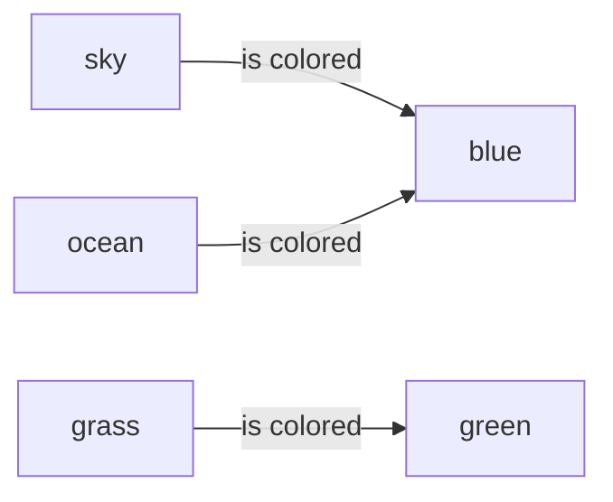

+++
title = "Overview of the Resource Description Framework (RDF)"
slug = "02182022165447-rdf-overview"
tags = ["rdf", "overview", "triplet", "graph", "framework", "archive"]
description = "An overview of the RDF and how it works"
rss_title = "Overview of the Resource Description Framework (RDF)"
rss_description = "An overview of the RDF and how it works"
rss_pubdate = Date(2022, 2, 18)
+++

Overview of the Resource Description Framework (RDF)
=========

**Date:** February 18 2022

**Summary:** An overview of the RDF and how it works

**Keywords:** #rdf #overview #triplet #graph #framework #archive

Bibliography
==========

W3C, "RDF 1.1 Concepts and Abstract Syntax." https://www.w3.org/TR/rdf11-concepts/ (accessed Feb. 18, 2022).

Table of Contents
=========

\toc

The Resource Description Framework (RDF) is a family of specifications created by the World Wide Web Consortium (W3C) and formally adopted by W3C in 1999. Data mapped into the RDF form into triplets called *RDF statements* (also known as Semantic Triplets).

### What Are RDF Triplets?

These triplets, or statements, are comprised of three components called the *subject*, the *predicate*, and the *object*. In summary, these components are described as:

  * **Subject** - this denotes a resource where anything can be a resource.

It is synonymous with the idea of an entity in other data models.

  * **Predicate** - traits or aspects of a defined resource and expresses the relationship between a **Subject** or a given **Object**.
  * **Object** - the target of the predicate and is similar to a resource in that anything can be an **Object**.

What the RDF statement compactly communicates is that there holds some relationship, indicated by the predicate, between the **Subject** and **Object**.

### What Are Examples of RDF Triplets?

Example RDF statements are:

>   * The sky is colored blue.

>   * Grass is colored green.

>   * The ocean is colored blue.

Taking the statement "The sky is colored blue." the **Subject** is the phrase "sky", the **Predicate** is the verb phrase "is colored", and the **Object** is the final phrase, "blue". Moving forward from this example, it may be useful to think of the RDF statement as a labeled directed multigraph where components of the statement are typically broken down and stored in Relational Database Management Systems or native RDF file storage formats. Here is a way of visualizing the triplet for the given statements above:

The RDF triples "The sky is colored blue.", "Grass is colored green.", and "The ocean is colored blue" can all be represented as a Directed Multigraph $G$. The nodes $sky$, $ocean$, and $grass$ are **Subjects**, the nodes $blue$ and $green$ are **Objects**, and the edge $is colored$ is the **Predicate** in these RDF triple.

## References

## References:
## Discussion: 

{{ addcomments }}
