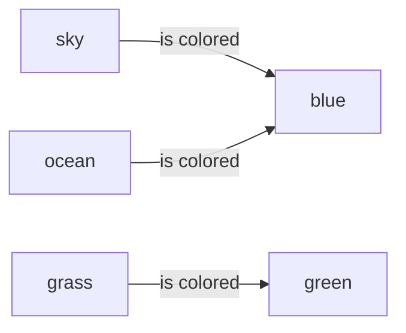

+++
title = "How To Imagine an RDF as an ACSet"
slug = "02182022190950-rdf-acset-representation"
tags = ["rdf", "acset", "graph", "triple", "archive"]
description = "How RDFs can be conceptualized as an ACSet"
rss_title = "How To Imagine an RDF as an ACSet"
rss_description = "How RDFs can be conceptualized as an ACSet"
rss_pubdate = Date(2022, 2, 18)
+++


How To Imagine an RDF as an ACSet
=========

**Date:** February 18 2022

**Summary:** How RDFs can be conceptualized as an ACSet

**Keywords:** #rdf #acset #graph #triple #archive

Bibliography
==========

W3C, "RDF 1.1 Concepts and Abstract Syntax." https://www.w3.org/TR/rdf11-concepts/ (accessed Feb. 18, 2022).

Table of Contents
=========

\toc

RDFs can be also formulated as ACSets. To show how this is possible, let's walk through an example on how this happens:

The RDF triples "The sky is colored blue.", "Grass is colored green.", and "The ocean is colored blue" can all be represented as a Directed Multigraph $G$.



$$
G
$$

can be thought of as an instance implementation of an ACSet representation of the RDF format. The ACSet schema defined for this family of RDFs can be defined at a higher level abstraction as follows:

```mermaid
Thing --is colored--> Color
```

*Thing* represents a generalized Subject Object, *Color* represents a generalized Resource Object, and *is colored* defines the Predicate morphism for this Category of RDFs.

TODO: Add connection to acsets note
## How To Cite

 Zelko, Jacob. _How To Imagine an RDF as an ACSet_. [https://jacobzelko.com/02182022190950-rdf-acset-representation](https://jacobzelko.com/02182022190950-rdf-acset-representation). February 18 2022.
## References:
## Discussion: 

{{ addcomments }}
