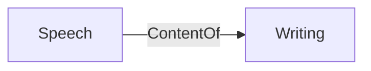
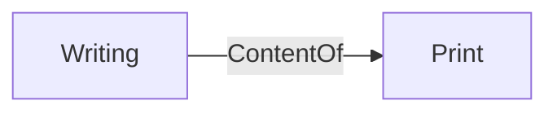
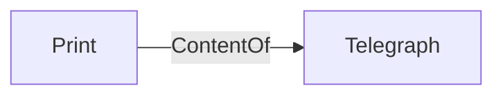

+++
title = "Understanding Media: The Extensions of Man"
slug = "05222022225241-understanding-media-extensions"
tags = ["book", "review", "media", "extensions", "anxiety", "society", "medium", "global", "village", "technology", "archive"]
description = "An overview on this excellent book on media philosophy and media's intersection with society and its affects on people and community as well as eerie premonitions for the future of a technological age."
rss_title = "Understanding Media: The Extensions of Man"
rss_description = "An overview on this excellent book on media philosophy and media's intersection with society and its affects on people and community as well as eerie premonitions for the future of a technological age."
rss_pubdate = Date(2022, 5, 22)
+++

Understanding Media: The Extensions of Man
=========

**Date:** May 22 2022

**Summary:** An overview on this excellent book on media philosophy and media's intersection with society and its affects on people and community as well as eerie premonitions for the future of a technological age.

**Keywords:** ##book #review #media #extensions #anxiety #society #medium #global #village #technology #archive

Bibliography
==========

M. McLuhan, "Understanding Media the Extensions of Man." London and New York, Oct. 1994.

Table of Contents
=========

\toc

### Reading Motivation

I had long heard about this author ever since high school. I recall one day picking up a book of his at my community college's library and being both interested and overwhelmed by it. I have never much read philosophy so this was my first time encountering such a book and at the time, I found it impenetrable beyond my preliminary glances. It wasn't until this year I ventured on a project to read his magnum opus, *Understanding Media: The Extensions of Man*, a nearly 400 page endeavor that spanned nearly 6 months.

I am sure for anyone more expert, they could've more readily finished such a book. But, although I found MacLuhan's ideas very fascinating as well as largely approachable, I could only truly approach and appreciate them if I read his work in very small chunks. So, I worked slowly through this book and have not regretted doing so a single moment.  This book was utterly life changing and has wide implications for the modern day despite this book being written nearly 70 years ago.

### The Action and the Reaction

MacLuhan puts forth an initial thought of the "action and the reaction". He mentions how in past ages, actions (particularly the development of novel technologies like of a better plow or even printing press) could be executed with relatively minimal care. Not "minimal" in the sense of a lack of importance but that the impact of an action rippled much more slowly through the world. The action could be followed by a well-thought out or better informed reaction by those the action was affecting.

However, today, "the action and the reaction occur almost [simultaneously]". The action and reaction to a technology used to be slow but now is instantly leaving behind those incapable of adapting to the novelty. As MacLuhan observed, this simultaneity prevents an acclimation period for persons as much of humanity continues to "think in the old, fragmented space and time patterns of the pre-electric age." [I intentionally invoke the word "simultaneity" here as I think this concept of "action and reaction" finds analogy within Einstein's notion of Relativity of Simultaneity](//12242022202340-relativity-information-gaps.md) TODO: Create note on Relativity of Simultaneity using this link: https://sites.pitt.edu/~jdnorton/teaching/HPS*0410/chapters/Special*relativity*rel*sim/index.html and this one: https://sites.pitt.edu/~jdnorton/Goodies/rel*of*sim/index.html TODO: Create separate note on analogy between Relativity of Simultaneity and Information Dissemination

In the past, MacLuhan posits that we used technology to create "extensions" that "extended" parts of our bodies – like a knife extending our teeth or a firearm extending our fists. Not so in the electric era.  Rather, we have "extended our central nervous system itself in a global embrace, abolishing both space and time[.]" MacLuhan believes that we are rapidly approaching the point in society and technology wherein, "the creative process of knowing will be collectively and corporately extended to the whole of human society. [... Where] it is no longer possible to adopt the aloof and dissociated role of the literate Westerner."

Everyone's business is now everyone's business.

### The Age of Anxiety

One idea that I think MacLuhan fantastically captured and explained much better than modern pundits and observers have done is how our age is one of anxiety. This has been bemoaned in many ways from multiple different groups – be they political, scientific or spiritual – but I have always found the notions being discussed to be buried too much in a specific domain or emerging trend. MacLuhan instead abstracts this concept to a much higher level that gives it, in my opinion, a much better resonance of the true problems of our electric age.

As he says, "If the nineteenth century was the age of the editorial chair, ours is the century of the psychiatrist's couch." Something that was hard to grasp at first was the careful delineation he made between a "chair" and a "couch". For him, the "chair" as an extension of man is a mechanical replacement of one's spine – a reinforcement to help the "sitter" maintain their position (on an argument or view).  Instead, the modern "couch" becomes an icon that offers no such support but a sort of endless collapse into ease that thwarts "the temptation to express private points of view and obviates the need to rationalize events."

"This is the Age of Anxiety for the reason of the electric implosion that compels commitment and participation, quite regardless of any "point of view"," is a line of thinking that links back this notion of the "Age of Anxiety" to his original idea on the "action and the reaction". As man in an electric society can no longer be an observer, the "point of view" (which I understand as one's own beliefs and thoughts about the world) one may have becomes an obstacle to a global society. Using the means of a psychiatrist's couch, we can become numbed to even our own beliefs and mental facilities. Instead, the current zeitgeist is to allow our "point of view" fall congruent to the will of the masses and governing authorities.

And here MacLuhan utters his famous line: "the globe is no more than a village," to illustrate how every problem, every action, every perspective, is now standing and staring at you and how *you* will act. "It is this implosive factor that alters the position of [various] groups. They can no longer be contained, in the political sense of limited association. They are now involved in our lives, as we in theirs, thanks to the electric media." We are now obligated to some involvement regardless of one exact point of view.

And therein lies the core problem of this Age of Anxiety: conflicting views in the electric age lead to adversity. Because what if we say, do, or think something that goes askew the prevailing global "point of view"? At best, one could be described as "quaint" or "old-fashioned" perhaps; at worst, one could be excommunicated from the village.

### The Medium Is the Message

I think I will have to read more of MacLuhan's work someday to better understand the concept of "medium" but this is my very loose understanding. As MacLuhan cryptically says, "the medium is the message," forming the key motif of this entire book. He builds upon earlier language around "extensions" to explain that the message conveyed by a medium consists of the "personal and social consequences" of a medium (i.e. an extension) that result from the scale introduced into our lives by each extension. In short, the message itself is the consequences of a medium that affect reality we inhabit.

In compliment to the "message" of a medium, the "'content' of any medium is always another medium." When I first read this, I was rather confused as it seemed in contradiction to my earlier understanding of what the message of a medium is. However, what MacLuhan was more referring to as "content" is not again so much the actual "information" in the message but more the "method" of its communication such as the following line of examples:

Using MacLuhan's notion of the "content" of a medium, we see that "speech" is fundamentally the content of the medium, "writing".

Then "writing" is the content of the medium of "print".

Finally, "print" is the content of the medium of the "telegraph".  MacLuhan did point out that you could go even further from the root of "speech" to muscle contractions in one's throat, to thought, etc. However, I, as well as MacLuhan, found that to be a bit inane and I find it reasonable to call speech a "fundamental" content. It is a bit confusing how MacLuhan uses "content" in this scenario but to summarize my understanding of his central treatise on what he means by "the medium is the message":

  * "[The] 'message' of any medium [...] is the change [...] that it introduces into human affairs."
  * "[T]he medium [...] shapes and controls [...] human association and action."
  * The "content" of any medium is another medium

Even though the delineation between what is a "medium", what is "content", and what is a "message" is thorny to parse from MacLuhan's writing (at least for me), I think this separation is wholly necessary. In fact, I think this delineation is what is missing from modern discourse on new mediums (ergo technologies). In culmination of this initial discussion on mediums, I think the most important takeaway for me about mediums is this quote: "it is only too typical that the 'content' of any medium blinds us to the character of the medium." We can limit ourselves by only thinking within existing "content" of a given "medium" rather than viewing the medium wholly.

In short, new mediums enable entirely novel realities. Letters were once highly cherished not only because of their "content" (i.e. the medium of writing and hand-writing) and their "information" (what did the letter say) but also due to the constrained medium of a letter. Letters could take days or weeks to be delivered and would have to encapsulate much within their "information". Now with the use of instant messaging, we have lost "content" (i.e. hand-writing) in this medium but it introduces an entirely new reality of interacting with the "content". The "information" conveyed by the "content" of instant messaging can be trivialized much more easily due to the instantaneous nature of the "medium" of instant messaging.

### Characteristics of a Medium

MacLuhan goes onto further explain the characteristics of a medium. "General David Sarnoff made this statement: "We are too prone to make technological instruments the scapegoats for the sins of those who wield them. The products of modern science are not in themselves good or bad; it is the way they are used that determines their value." That is the voice of the current somnambulism. Suppose we were to say, "Apple pie is in itself neither good nor bad; it is the way it is used that determines its value." Or, "The smallpox virus is in itself neither good nor bad; it is the way it is used that determines its value." Again, "Firearms are in themselves neither good nor bad; it is the way they are used that determines their value." That is, if the slugs reach the right people firearms are good." (McLuhan, 1994, p. 13)

"any medium has the power of imposing its own assumption on the unwary" (McLuhan, 1994, p. 17)

"greatest aid to this end is simply in knowing that the spell can occur immediately upon contact" (McLuhan, 1994, p. 17)

Mediums are virulent. They can infect, inspire, and alter oneself all at once.

"literate man is quite inclined to see others who cannot conform as somewhat pathetic" (McLuhan, 1994, p. 18)

"testers assume that uniform and continuous habits are a sign of intelligence, thus eliminating the ear man and the tactile man" (McLuhan, 1994, p. 18)

Could it be said that these could be geniuses, those who do not conform?

The private point of view according to McLuhan is all at once an illusion as we become who we behold

How media affect or leach into a community should be the underlying area of study in examining the impacts of a media.

"we are losing all confidence in our right to assign guilt" (McLuhan, 1994, p. 22)

Assigning guilt is lost in the electric area. Calling anything wrong or crazy is impossible.

### Types of Mediums

#### Hot Mediums

"A hot medium is one that extends one single sense in "high definition." High definition is the state of being well filled with data." (McLuhan, 1994, p. 30)

"A photograph is, visually, "high definition." A cartoon is "low definition," simply because very little visual information is provided. Telephone is a cool medium. or one of low definition, because the ear is given a meager amount of information" (McLuhan, 1994, p. 30)

"Hot media are, therefore, low in participation, and cool media are high in participation or completion by the audience" (McLuhan, 1994, p. 31)

"For myth is the instant vision of a complex process that ordinarily extends over a long period. Myth is contraction or implosion of any process, and the instant speed of electricity confers the mythic dimension on ordinary industrial and social" (McLuhan, 1994, p. 33)

"We are certainly coming within conceivable range of a world automatically controlled to the point where we could say, "Six hours less radio in Indonesia next week or there will be a great falling off in literary attention." Or, "We can ! program twenty more hours of TV in South Africa next week to cool down the tribal temperature raised by radio last week." Whole cultures could now be programmed to keep their emotional climate stable in the same way that we have begun to know something about maintaining equilibrium in the commercial economies of the world" (McLuhan, 1994, p. 36) media based influence and control of ideas

### Creation of New Systems

"One of the most common causes of breaks in any system is the cross-fertilization with another system, such as happened to print with the steam press, or with radio and movies (that yielded the talkies)." (McLuhan, 1994, p. 49)

"Except for light, all other media come in pairs, with one acting as the "content" of the other, obscuring the operation of both" (McLuhan, 1994, p. 63)

McLuhan says that the artist is always the first person to make the intersection of mediums powerful. I wonder if that is so.

"The moment of the meeting of media is a moment of freedom and release from the ordinary trance and numbness imposed by them on our senses." (McLuhan, 1994, p. 67)

"That is what is meant when we say that we daily know more and more about man. We mean that we can translate more and more of ourselves into other forms of expression that exceed ourselves. Man is a form of expression who is traditionally expected to repeat himself and to echo the praise of his Creator" (McLuhan, 1994, p. 69)

I really like this idea that man itself is a type of expression. Meaning, translation is infinite.

He makes an interesting observation about people who are illiterate to this age. They afford technology a sort of tribal magic much like how inexperienced investors expect to make money by throwing funds into stock.

Missing the whole for the parts.

"The artist is the man in any field, scientific or humanistic, who grasps the implications of his actions and of new knowledge in his own time" (McLuhan, 1994, p. 78)

He goes into great detail about how the artists are the ones able to react to new technologies. Is is them who can express the groans of the current reality.

### Surviving an Impossible World

"it is obvious that numbness is the result of any prolonged terror" (McLuhan, 1994, p. 39)

"The price of eternal vigilance is indifference." (McLuhan, 1994, p. 39)

Autoamputation is an interesting thought. I was unsure what was meant at first but realize it is the process by which to externalize or remove an internal irritant through some kind of self extension.

The suicidal autoamputation is a more heinous variety where all experiences are external separate to the body. Makes me think of VR and Meta. He points out that this happens because we are not equipped to handle such extreme serialization.

A "closure" is the idea that a person conforms perceptually to a media they are immersed in - like Psalm 113. Finally, more of an explanation on what closures are. They are the worlds media make for themselves.

"We have to numb our central nervous system when it is extended and exposed, or we will die" (McLuhan, 1994, p. 57)

"Thus the age of anxiety and of electric media is also the age of the unconscious and of apathy." (McLuhan, 1994, p. 58)

"Our private and corporate lives have become information processes just because we have put our central nervous systems outside us in electric technology." (McLuhan, 1994, p. 63)

"The mark of our time is its revulsion against imposed patterns. We are suddenly eager to have things and people declare their beings totally." (McLuhan, 1994, p. 8)

Is it wise that we have this revulsion against patterns? Rather, I find it a possible societal regression of a kind. Why do we say in hubris that we know now better to live than in any time of human history? Is man, unrestrained, really man or some primal, base thing?

### Media as Extensions of Tyranny and Labor

This is an interesting thought that as the means of communication are improved, so are the means of tyranny

"A speed-up in communications always enables a central authority to extend its operations to more distant margins" (McLuhan, 1994, p. 109)

Clothing can be thought of as an extension as it concerns one's ability interact with the environment.

Light enables a whole new world or worlds and abolishes the notion of night and day.

"Time is money," and money is the store of other people's time and effort" (McLuhan, 1994, p. 152)

Money is the ultimate store of collective human endeavors and the translator of work from priest to prostitute.

"Automation, which is electronic, does not represent physical work so much as programmed knowledge" (McLuhan, 1994, p. 154)

"Although the medium is the message, the controls go beyond programming. The restraints are always directed to the "content," which is always another medium. The content of the press is literary statement, as the content of the book is speech, and the content of the movie is the novel. So the effects of radio are quite independent of its programming" (McLuhan, 1994, p. 337)

Money is not a closed system

### On Photography and Travel

"Time can be defeated, as it were, by reversal of its characteristics if only it be speeded up enough" (McLuhan, 1994, p. 170)

"The age of Jung and Freud is, above all, the age of the photograph, the age of the full gamut of self-critical attitudes" (McLuhan, 1994, p. 218)

I love this critique of photos and travel. Basically, as time goes on the value of those hobbies or objects dull our senses or sense of wonder.

"contrived, prefabricated." He is not concerned to find out why the photograph has done this to us. But in the same way intelligent people in the past always deplored the way in which the book had become a substitute for inquiry, conversation, and reflection, and never troubled to reflect on the nature of the printed book. The book reader has always tended to be passive, because that is the best way to read. Today, the traveler has become passive" (McLuhan, 1994, p. 219)

### How Media Changes Our Habits

"Difficulty of access does not confer adequacy of perception, though it may involve an object in an aura of pseudo-values, as with a gem, a movie star, or an old master" (McLuhan, 1994, p. 220)

"This now brings us to the factual core of the "pseudoevent," a label applied to the new media, in general, because of their power to give new patterns to our lives by acceleration of older patterns" (McLuhan, 1994, p. 220)

"All media exist to invest our lives with artificial perception and arbitrary values" (McLuhan, 1994, p. 220)

"The car has become the carapace, the protective and aggressive shell, of urban and suburban man" (McLuhan, 1994, p. 248)

### Ads as Reflection of Actual Society

"Ads are news. What is wrong with them is that they are always good news" (McLuhan, 1994, p. 231)

"The steady trend in advertising is to manifest the product as an integral part of large social purposes and processes. With very large budgets the commercial artists have tended to develop the ad into an icon, and icons are not specialist fragments or aspects but unified and compressed images of complex kind. They focus a large region of experience in tiny compass" (McLuhan, 1994, p. 250)

He has a bullseye view of ads in my opinion - its how the milk ads can appear so important to society.

"there are the new massive iconic ads with their compressed images that include producer and consumer, seller and society in a single image" (McLuhan, 1994, p. 251)

"Ads seem to work on the very advanced principle that a small pellet or pattern in a noisy, redundant barrage of repetition will gradually assert itself. Ads push the principle of noise all the way to the plateau of persuasion. They are quite in accord with the procedures of brain-washing" (McLuhan, 1994, p. 251)

"Ads are not meant for conscious consumption. They are intended as subliminal pills for the subconscious in order to exercise an hypnotic spell" (McLuhan, 1994, p. 252)

### Media and Society

"Any community that wants to expedite and maximize the exchange of goods and services has simply got to homogenize its social life" (McLuhan, 1994, p. 253)

This line makes me think of of Kuhn's idea of incommensurability.

"our intensely individualist and fragmented Western world, "booze" is a social bond and a means of festive involvement. By contrast, in closely knit tribal society "booze" is destructive of all social pattern and is even used as a means to mystical experience" (McLuhan, 1994, p. 258)

Interesting observation on the role of alcohol in communities.

"Just as we now try to control atom-bomb fallout, so we will one day try to control media fallout. Education will become recognized as civil defense against media fallout" (McLuhan, 1994, p. 337)

### Comedy

"We think of humor as a mark of sanity for a good reason: in fun and play we recover the integral person, who in the workaday world or in professional life can use only a small sector of his being" (McLuhan, 1994, p. 259)

Beautiful commentary on comedy as a sort of lifeline to the self in a way.

### Games as a Media

"A game is a machine that can get into action only if the players consent to become puppets for a time" (McLuhan, 1994, p. 263)

"Perhaps there is, just for this reason, a desperate need for games in a highly specialized industrial culture, since they are the only form of art accessible to many minds" (McLuhan, 1994, p. 266)

"A moral point of view too often serves as a substitute for understanding in technological matters. That games are extensions, not of our private but of our social selves, and that they are media of communication, should now be plain. If, finally, we ask, "Are games mass media?" the answer has to be "Yes." Games are situations contrived to permit simultaneous participation of many people in some significant pattern of their own corporate lives." (McLuhan, 1994, p. 270)

### Media and the Nature of Work

"From this time on, the mere specialist in any field was doomed to the sterility and inanity that echoed an archaic form of the departing mechanical age" (McLuhan, 1994, p. 275)

Really makes me think of Willy Loman from Death of a Salesman and my own grandfather.

"Therefore, no new idea ever starts from within a big operation. It must assail the organization from outside, through some small but competing organization" (McLuhan, 1994, p. 277)

This reminds me of the verse that says how no student can be above his teacher.

"Northcote Parkinson's law that "work expands so as to fill the time available for its completion" is precisely the zany dynamic provided by the telephone" (McLuhan, 1994, p. 290)

"the main "work to be done" is actually the movement of information. The mere interrelating of people by selected information is now the principal source of wealth in the electric age" (McLuhan, 1994, p. 291)

It is an interesting remark on labor saving devices. Rather than freeing up time, you end up doing more labor and work than before. It brought down the barrier of entry for menial tasks so all could do them.

"A mechanized world is always in the process of getting ready to live, and to this end it brings to bear the most appalling pomp of skill and method and resourcefulness" (McLuhan, 1994, p. 321)

"The world eagerly lined up to buy canned dreams" (McLuhan, 1994, p. 322)

### The Nature of Radio as a Media

"To the blind, all things are unexpected" (McLuhan, 1994, p. 294)

"The telephone: speech without walls. The phonograph: music hall without walls. The photograph: museum without walls. The electric light: space without walls" (McLuhan, 1994, p. 313)

"What the Orient saw in a Hollywood movie was a world in which all the ordinary people had cars and electric stoves and refrigerators. So the Oriental now regards himself as an ordinary person who has been deprived of the ordinary man's birthright" (McLuhan, 1994, p. 325)

"If a government monopolizes the radio, then by mere repetition and byRADIO 325 exclusion of conflicting points of view it can determine the opinions of the population" (McLuhan, 1994, p. 328)

"This is inherent in the very nature of this medium, with its power to turn the psyche and society into a single echo chamber" (McLuhan, 1994, p. 331)

### Television's Idiosyncrasies as a Media

"TV is a medium that rejects the sharp personality and favors the presentation of processes rather than of products" (McLuhan, 1994, p. 341)

"grammars of newspaper, or radio, or of film, but who look askew and askance at all non-book media. The simplest question about any psychic aspect, even of the book medium, throws these people into a panic of uncertainty. Vehemence of projection of a single isolated attitude they mistake for moral vigilance. Once these censors became aware that in all cases "the medium is the message" or the basic source of effects, they would turn to suppression of media as such, instead of seeking "content" control. Their current assumption that content or programming is the factor that influences outlook and action is derived from the book medium, with its sharp cleavage between form and content" (McLuhan, 1994, p. 347)

"The failure of the sex-integration programs has provided the theme of much of the literature and psychoanalysis of the twentieth century. Race integration, undertaken on the basis of visual uniformity, is an extension of the same cultural strategy of literate man, for whom differences always seem to need eradication, both in sex and in race, and in space and in time" (McLuhan, 1994, p. 349)

"Print gave intensity and uniform precision, where before there had been a diffuse texture. Print brought in the taste for exact measurement and repeatability that we now associate with science and mathematics" (McLuhan, 1994, p. 350)

"The same new preference for depth participation has also prompted in the young a strong drive toward religious experience with rich liturgical overtones" (McLuhan, 1994, p. 354)

"anybody whose appearance strongly declares his role and status in life is wrong for TV Anybody who looks as if he might be a teacher, a doctor, a businessman, or any of a dozen other things all at the same time is right for TV" (McLuhan, 1994, p. 365)

"The TV child expects involvement and doesn't want a specialist job in the future. He does want a role and a deep commitment to his society" (McLuhan, 1994, p. 370)

"The TV child cannot see ahead because he wants involvement, and he cannot accept a fragmentary and merely visualized goal or destiny in learning or in life" (McLuhan, 1994, p. 370)

### Miscellany

"Since our new electric technology is not an extension of our bodies but of our central nervous systems, we now see all technology, including language, as a means of processing experience, a means of storing and speeding information. And in such a situation all technology can plausibly be regarded as weapons" (McLuhan, 1994, p. 379)

"Dewart in his Crintanity adn Revolution, wehn he points tothe obsolescence fo the fragemnted balance of power techniques. As an instrument of policy, modern war has come to mean "the existence and end of one society tot he esclusion of another" (McLuhan, 1994, p. 381)

"Any subject taken in depth at once relates to other subjects. Arithmetic in grade three or nine, when taught in terms of number theory, symbolic logic, and cultural history, ceases to be mere practice in problems. Continued in their present patterns of fragmented unrelation, our school curricula will insure a citizenry unable to understand the cybernated world in which they live" (McLuhan, 1994, p. 383)

"Men are suddenly nomadic gatherers of knowledge, nomadic as never before, informed as never before, free from fragmentary specialism as never before –but also involved in the total social process as never before; since with electricity we extend our central nervous system globally, instantly interrelating every human experience" (McLuhan, 1994, p. 395)

"Tradition, in a word, is the sense of the total past as now" (McLuhan, 1994, p. 333)

"Everybody experiences far more than he understands" (McLuhan, 1994, p. 351)

"Before the huddle of the city, there was the food-gathering phase of man the hunter, even as men have now in the" (McLuhan, 1994, p. 378)

"electric age returned psychically and socially to the nomad state. Now, however, it is called information-gathering and data-processing" (McLuhan, 1994, p. 379)

"As Selye deals with the total environmental situation in his "stress" theory of disease, so the latest approach to media study considers not only the "content" but the medium and the cultural matrix within which the particular medium operates." (McLuhan, 1994, p. 13) How fascinating! McLuhan knew of the stress theory of disease. I wonder how he knew that? I find it so fascinating the analogy McLuhan is making. It seems as though McLuhan proposes to say that the medium is an organ which interplay’s with Selye's theory. Rather than contradicting or separate from it, it subsists within and intertwined with this theory. In short, McLuhan seems to say that whereas Selye took an environmental approach to disease, McLuhan is taking a holistic view to mediums in a person's life

Selye's work preceded the work of Sir Michael Marmot in creating the Social Determinants of Health. Plus he was starting with the idea of metastatic load.
## How To Cite

 Zelko, Jacob. _Understanding Media: The Extensions of Man_. [https://jacobzelko.com/05222022225241-understanding-media-extensions](https://jacobzelko.com/05222022225241-understanding-media-extensions). May 22 2022.
## References:
## Discussion: 

{{ addcomments }}
